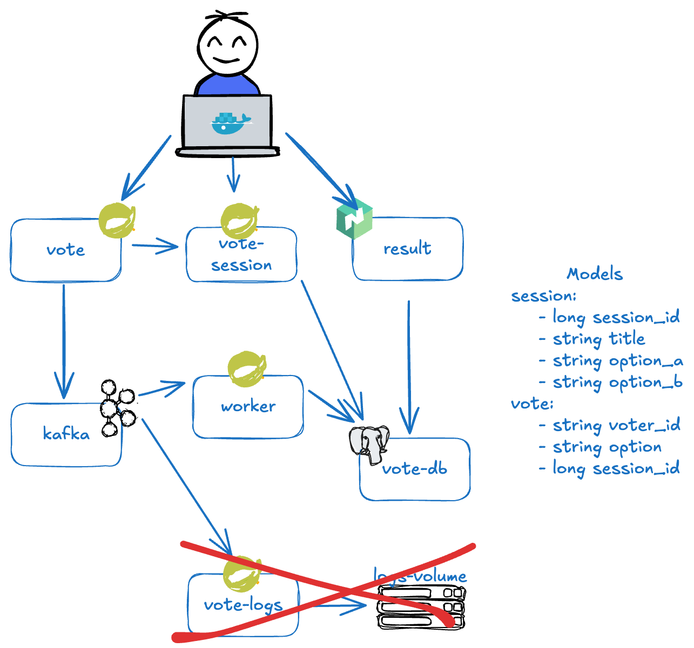

# Voting App

A simple distributed voting application orchestrated with Docker containers.

This project is inspired by [Spring's docker samples](https://github.com/dockersamples/example-voting-app) and enhanced with Spring Boot and Kafka integration. The application enables users to vote between two options and demonstrates a microservices architecture.

This project showcases how to build and run a distributed application using Docker, Spring Boot, Kafka, and Node.js.

## Getting started

Download [Docker Desktop](https://www.docker.com/products/docker-desktop) for Mac or Windows. [Docker Compose](https://docs.docker.com/compose) will be automatically installed. On Linux, make sure you have the latest version of [Compose](https://docs.docker.com/compose/install/).

This solution uses Spring Boot, Node.js with Kafka for messaging and Postgres for storage.

Run in this directory to build and run the app:

```shell
docker compose up
```

The `vote` app will be running at [http://localhost:8080](http://localhost:8080), and the `results` will be at [http://localhost:8081](http://localhost:8081).

## Architecture



* A front-end web app [Spring Boot/Thymeleaf](/vote) for submitting votes and lets you create multiple voting sessions
* A [Kafka](https://hub.docker.com/_/redis/) message broker for handling vote events
* A [Spring Boot](/worker/) worker service to process and persist votes in a Postgres database.
* A [Spring Boot](/vote-session) REST API for managing voting sessions
* A [Postgres](https://hub.docker.com/_/postgres/) database 
* A [Node.js](/result) web app for displaying real-time results

## Notes

The voting application only accepts one vote per client browser. It does not register additional votes if a vote has already been submitted from a client.
