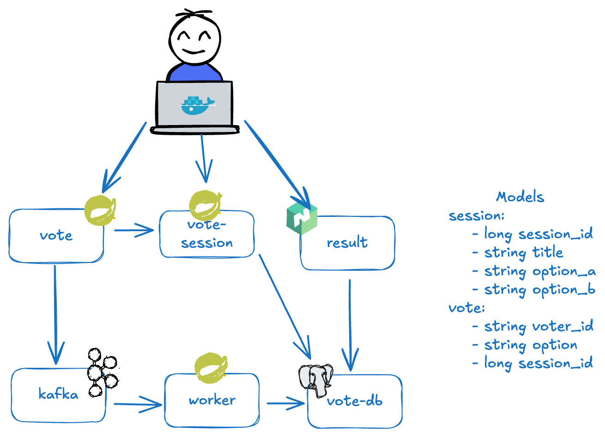

## Architecture

* A front-end web app in [Spring Boot/Thymeleaf](/vote) which lets you vote between two options
* A [Kafka](https://hub.docker.com/_/redis/) which collects new votes
* A [Spring Boot](/worker/) worker which consumes votes and stores them in…
* A [Spring Boot](/vote-logs/) worker which consumes votes and stores them as logs in disk backed by volume. 
* A [Postgres](https://hub.docker.com/_/postgres/) database 
* A [Node.js](/result) web app which shows the results of the voting in real time